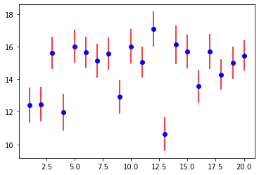
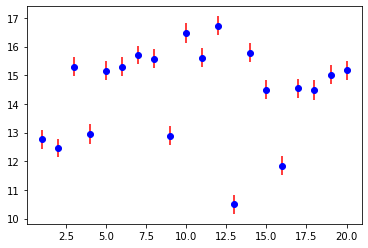
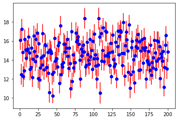
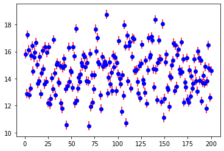
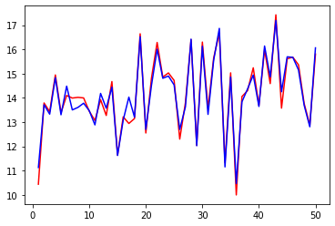
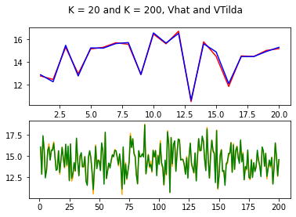

```python
import numpy as np
from math import sqrt as sqrt
from statistics import mean as mean
import matplotlib.pyplot as plt

from sklearn.metrics import mean_squared_error
from keras.models import Sequential
from keras.layers import Dense
```

    Using TensorFlow backend.


# Problem Statement

Simulate a full path of a DTMC for an appropriate inventory model, and use the Monte Carlo method to estimate its corresponding discounted value function. Compare the resulting values with a neural network, and on the mean squared errors.

Inventory Model: Consider a perishable product with a maximum lifetime of L periods. Thus, at the end of period t, there may be leftover inventory of this product with a remaining lifetime j such that $ 1 <= j <= L - 1 $. Any leftover items with 0 remaining life is considered "expired" and will be disposed. Let $X_tj$ be the amount of inventory with remaining lifetime less or equal to j after the "expired items" are disposed, then the system state by the end of the period $t$ is $X_t = (X_{t1}, X_{t2},...,X_{t,L-1})^4$. $X_{tj}-X_{t,j-1}$ is the number of items with remaining lifetime exactly $j \in {2,3,...,L-1}$.
By the end of period $t-1$, after disposing expired items, an order for $Q-X_{t-1,L-1}$ units of new items is placed. At the beginning of period $t$, $Q-X_{t-1,L-1}$ units of new items arrive, bringing the total inventory level to Q. The variable cost $c_v$ per unit is paid when new inventory arrives. A random demand $D_t$ then occurs and is met immediately as much as possible with inventory from oldest to newest. Demand across different periods is assumed to be i.i.d. and follows Poisson distribution with mean $\lambda$. Unmet demand is lost. At the end of period $t$, expired invenory is disposed at cost $c_d$ per unit, and leftover inventory incurs a holding cost $h$ per unit. 
In our model, the selling price $c_p = 1$, variable cost $c_v = 0.4$, disposal cost $c_d=0.1$, holding cost $h=0.1$, and the demand rate is $\lambda=17$. 

## Sampling a full DTMC path for 20 states and 20*10^3 time intervals


```python
# Function state_subset

# Required parameters
# K: number of states selected in subset
# T: total amount of time intervals
# x0n: initial state value of the amount of items with remaining lifetime less than or equal to n

# Returns
# subset: subset of K values, taken from larger state set of T time intervals

def state_subset(K, T, x01, x02, x03, x04, x05, x06):
    Q = 90
    L = 7
    x1 = x01
    x2 = x02
    x3 = x03
    x4 = x04
    x5 = x05
    x6 = x06

    states = np.empty([0,6], dtype = int) 

    for t in range(T):
        D = np.random.poisson(17)
        # simulating next state using DTMC property
        x1 = max(x2 - x1 - max(D - x1,0),0) 
        x2 = max(x3 - x2 - max(D - x2,0),0) + x1
        x3 = max(x4 - x3 - max(D - x3,0),0) + x2
        x4 = max(x5 - x4 - max(D - x4,0),0) + x3 
        x5 = max(x6 - x5 - max(D - x5,0),0) + x4
        x6 = max((Q - x6) - max(D - x6,0),0) + x5
        state = np.array([[x1, x2, x3, x4, x5, x6]])
        states = np.row_stack((states, state))
    
    subset = np.empty([0,6], dtype = int)
    for k in range(K):
        index = (k+1)*(10**3)-1
        state = states[index]
        subset = np.row_stack((subset, state))
    return subset

# generating full path of DTMC where K = 20
K = 20 
T = (10**3) * K 
subset20 = state_subset(K, T, 0,0,0,0,0,0)
print('Subset of states where K = 20')
print(subset20)
```

    Subset of states where K = 20
    [[ 0  0 15 31 48 69]
     [ 0  0 15 31 58 68]
     [11 24 37 50 63 75]
     [ 0 12 31 39 54 69]
     [ 0  0 12 41 57 75]
     [ 0  8 28 48 63 75]
     [ 0  0 20 38 63 76]
     [ 0  0 14 32 52 76]
     [ 0  0 14 32 48 69]
     [ 5 20 37 53 68 78]
     [ 0 12 27 40 58 76]
     [ 0 16 34 54 71 78]
     [ 0  0 12 29 41 63]
     [ 0  0 20 43 61 76]
     [11 24 36 51 60 73]
     [ 0  0 14 33 50 67]
     [ 0 11 28 45 55 73]
     [ 0  6 26 40 58 73]
     [ 0  0 10 30 49 74]
     [ 0  0 16 34 53 75]]


## Sampling a DTMC with 200 states and 200*10^3 time intervals


```python
K = 200
T = (10**3) * K 

# generating full path of DTMC where K = 200
subset200 = state_subset(K, T,0,0,0,0,0,0)

print('Subset of states where K = 200')
print(subset200)
```

    Subset of states where K = 200
    [[ 0  7 19 39 55 77]
     [ 0  0 11 34 52 69]
     [ 0 11 28 42 63 80]
     ...
     [ 0  5 20 38 55 74]
     [ 0 11 24 39 53 68]
     [ 0  8 20 42 53 73]]


## Calculate the estimated expected profit and its confidence interval for 20 states, over 100 episodes


```python
# Function get_values

# Required parameters 
# K: number of states selected in subset
# N: amount of times to run Monte-Carlo method with initial kth initial state
# T: amount of time intervals from inital kth state 
# subset: the subset to get initial states from 
# disp: True or False, depending on whether you want values to be displayed or not

# Returns 
# est_values: estimated values from Monte Carlo method 
# epsilons: epsilon values corresponding to the estimated values from the Monte Carlo method 


def get_values(K, N, T, subset, disp):
    Q = 90
    L = 7
    cp = 1.0
    cv = 0.4
    cd = 0.1
    h = 0.1
    b = 0.8
    
    values = np.array([[]])
    est_values = np.array([[]])
    epsilons = np.array([[]])
    
    for k in range(K):
    
        for n in range(N):
            x1 = subset[k][0]
            x2 = subset[k][1]
            x3 = subset[k][2]
            x4 = subset[k][3]
            x5 = subset[k][4]
            x6 = subset[k][5]
            v = 0
        
            for t in range(T):
                D = np.random.poisson(17)
                # Discounted value function
                revenue = cp*D
                order_cost = cv*(Q-x6)
                disposal_cost = cd*max(x1-D, 0)

                x1 = max(x2 - x1 - max(D - x1,0),0) 
                x2 = max(x3 - x2 - max(D - x2,0),0) + x1
                x3 = max(x4 - x3 - max(D - x3,0),0) + x2
                x4 = max(x5 - x4 - max(D - x4,0),0) + x3 
                x5 = max(x6 - x5 - max(D - x5,0),0) + x4
                x6 = max((Q - x6) - max(D - x6,0),0) + x5
            
                hold_cost = h*x6
                profit = revenue - order_cost - disposal_cost - hold_cost
                v = v + (b**t)*profit
            
            values = np.append(values,v)

        value_mean = mean(values)
        est_values = np.append(est_values, value_mean)
        epsilon = 1.96*np.std(values)/sqrt(N)
        epsilons = np.append(epsilons, epsilon)
        values =  np.array([[]])
        
        if disp:
            # Display each state, estimated. value, 95% level CI 
            print('Initial state k =',(k+1), subset20[k])
            print('Estimated value:', value_mean)
            # CI Interval
            print('Confidence interval: [', (value_mean - epsilon), ',', (value_mean + epsilon), '] \n')

    return est_values, epsilons

K = 20
N = 100
T = 100 
# Length of episode t = 100
# We want to use a T value where we can approximate beta^T = 0 as best and as reasonable as possible.
    
values = get_values(K, N, T, subset20, True)
```

    Initial state k = 1 [ 0  0 15 31 48 69]
    Estimated value: 13.154527256970121
    Confidence interval: [ 12.05684391356044 , 14.252210600379803 ] 
    
    Initial state k = 2 [ 0  0 15 31 58 68]
    Estimated value: 11.946919721352455
    Confidence interval: [ 10.897777584782146 , 12.996061857922763 ] 
    
    Initial state k = 3 [11 24 37 50 63 75]
    Estimated value: 14.512107045726175
    Confidence interval: [ 13.429798949906186 , 15.594415141546165 ] 
    
    Initial state k = 4 [ 0 12 31 39 54 69]
    Estimated value: 12.73351818904854
    Confidence interval: [ 11.747893368214001 , 13.71914300988308 ] 
    
    Initial state k = 5 [ 0  0 12 41 57 75]
    Estimated value: 14.528710739917605
    Confidence interval: [ 13.624966411151934 , 15.432455068683275 ] 
    
    Initial state k = 6 [ 0  8 28 48 63 75]
    Estimated value: 15.276378933901587
    Confidence interval: [ 14.16987039932482 , 16.382887468478355 ] 
    
    Initial state k = 7 [ 0  0 20 38 63 76]
    Estimated value: 15.579394251642283
    Confidence interval: [ 14.485024838826309 , 16.673763664458257 ] 
    
    Initial state k = 8 [ 0  0 14 32 52 76]
    Estimated value: 15.180242482139409
    Confidence interval: [ 14.024328321450781 , 16.336156642828037 ] 
    
    Initial state k = 9 [ 0  0 14 32 48 69]
    Estimated value: 12.648113165235673
    Confidence interval: [ 11.608629322105527 , 13.687597008365818 ] 
    
    Initial state k = 10 [ 5 20 37 53 68 78]
    Estimated value: 16.938579761400042
    Confidence interval: [ 15.822637114662129 , 18.054522408137956 ] 
    
    Initial state k = 11 [ 0 12 27 40 58 76]
    Estimated value: 15.97277027653895
    Confidence interval: [ 14.85831385317884 , 17.087226699899063 ] 
    
    Initial state k = 12 [ 0 16 34 54 71 78]
    Estimated value: 16.12397839802556
    Confidence interval: [ 15.06160591431159 , 17.18635088173953 ] 
    
    Initial state k = 13 [ 0  0 12 29 41 63]
    Estimated value: 10.218767791312663
    Confidence interval: [ 9.054769772311444 , 11.382765810313883 ] 
    
    Initial state k = 14 [ 0  0 20 43 61 76]
    Estimated value: 15.134744949656087
    Confidence interval: [ 14.125297903034925 , 16.14419199627725 ] 
    
    Initial state k = 15 [11 24 36 51 60 73]
    Estimated value: 13.80222311996993
    Confidence interval: [ 12.795849156777656 , 14.808597083162205 ] 
    
    Initial state k = 16 [ 0  0 14 33 50 67]
    Estimated value: 12.010052609821656
    Confidence interval: [ 10.868949834363729 , 13.151155385279583 ] 
    
    Initial state k = 17 [ 0 11 28 45 55 73]
    Estimated value: 14.73355239014639
    Confidence interval: [ 13.715573435898435 , 15.751531344394344 ] 
    
    Initial state k = 18 [ 0  6 26 40 58 73]
    Estimated value: 14.633327178402507
    Confidence interval: [ 13.460670456308003 , 15.80598390049701 ] 
    
    Initial state k = 19 [ 0  0 10 30 49 74]
    Estimated value: 14.791854027090542
    Confidence interval: [ 13.856962581428165 , 15.726745472752919 ] 
    
    Initial state k = 20 [ 0  0 16 34 53 75]
    Estimated value: 14.101894019032436
    Confidence interval: [ 13.057245847076793 , 15.146542190988079 ] 
    


## Plot the estimated expected profit with its 95% confidence interval for 20 states, 100 time intervals, over 100 episodes


```python
K = 20
N = 100
T = 100

values = get_values(K, N, T, subset20, False)
est_values = values[0]
epsilons = values[1]

for k in range(20):
    plt.errorbar((k+1), est_values[k], yerr = epsilons[k], ecolor = 'red')
    plt.plot(k+1, est_values[k], 'bo')
```


    

    


## Plot the estimated expected profit with its 95% confidence interval for 20 states, 1000 time intervals, over 1000 episodes


```python
K = 20
N = 1000 
T = 1000

values20 = get_values(K, N, T, subset20, False)
est_values20 = values20[0]
epsilons20 = values20[1]

for k in range(20):
    plt.errorbar((k+1), est_values20[k], yerr = epsilons20[k], ecolor = 'red')
    plt.plot(k+1, est_values20[k], 'bo')
```


    

    


## Plot the estimated expected profit with its 95% confidence interval for 200 states, 100 time intervals, over 100 episodes


```python
K = 200
N = 100
T = 100

values = get_values(K, N, T, subset200, False)
est_values = values[0]
epsilons = values[1]

for k in range(K):
    plt.errorbar((k+1), est_values[k], yerr = epsilons[k], ecolor = 'red')
    plt.plot(k+1, est_values[k], 'bo')
```


    

    


## Plot the estimated expected profit with its 95% confidence interval for 200 states, 1000 time intervals, over 1000 episodes


```python
K = 200
N = 1000
T = 100

values200 = get_values(K, N, T, subset200, False)
est_values200 = values200[0]
epsilons200 = values200[1]

for k in range(K):
    plt.errorbar((k+1), est_values200[k], yerr = epsilons200[k], ecolor = 'red')
    plt.plot(k+1, est_values200[k], 'bo')
```


    

    


## Set Up Neural Network


```python
class MyNeuralNetwork:
    def __init__ (self, input_dimension):
        self.model = Sequential()
        self.model.add(Dense(5, input_dim = input_dimension, activation = 'relu'))
        self.model.add(Dense(5, activation = 'relu'))
        self.model.add(Dense(1, activation = 'linear'))
        self.model.compile(loss = 'mean_squared_error', optimizer = 'adam')
```

## Extract the Dataset


```python
N = 1000
t = 100
x_train = subset200
x_test = [[10,20,30,40,50,80]]
y_train = est_values200

y_values =  get_values(1, N, t, x_test, False)
y_test = y_values[0]
y_epsilons = y_values[1]
```

## Normalize Dataset Using Scalar


```python
class Scaler:
    def __init__ (self, x, y):
        self.x_mean = np.mean(x, axis = 0)
        self.y_mean = np.mean(y)
        self.x_std = np.std(x, axis = 0)
        self.y_std = np.std(y)
    
    def get_x (self):
        return self.x_std, self.x_mean
    
    def get_y (self):
        return self.y_std, self.y_mean
```


```python
normalizer = Scaler(x_train, y_train)
std_x, mean_x = normalizer.get_x()
x_train_norm = (x_train - mean_x)/(std_x)
x_test_norm = (x_test - mean_x)/(std_x)
std_y, mean_y = normalizer.get_y()
y_train_norm = (y_train - mean_y)/(std_y)
```

## Train the Dataset Using Neural Network Model 


```python
neural_network = MyNeuralNetwork(input_dimension = 6)
neural_network.model.fit(x_train_norm, y_train_norm, epochs = 100, batch_size = 8)
```

    Epoch 1/100
    200/200 [==============================] - 1s 3ms/step - loss: 0.7944
    Epoch 2/100
    200/200 [==============================] - 0s 161us/step - loss: 0.7538
    Epoch 3/100
    200/200 [==============================] - 0s 150us/step - loss: 0.7204
    Epoch 4/100
    200/200 [==============================] - 0s 153us/step - loss: 0.6895
    Epoch 5/100
    200/200 [==============================] - 0s 163us/step - loss: 0.6581
    Epoch 6/100
    200/200 [==============================] - 0s 163us/step - loss: 0.6287
    Epoch 7/100
    200/200 [==============================] - 0s 166us/step - loss: 0.5913
    Epoch 8/100
    200/200 [==============================] - 0s 169us/step - loss: 0.5537
    Epoch 9/100
    200/200 [==============================] - 0s 163us/step - loss: 0.5127
    Epoch 10/100
    200/200 [==============================] - 0s 171us/step - loss: 0.4667
    Epoch 11/100
    200/200 [==============================] - 0s 163us/step - loss: 0.3963
    Epoch 12/100
    200/200 [==============================] - 0s 165us/step - loss: 0.2988
    Epoch 13/100
    200/200 [==============================] - 0s 168us/step - loss: 0.2435
    Epoch 14/100
    200/200 [==============================] - 0s 167us/step - loss: 0.2123
    Epoch 15/100
    200/200 [==============================] - 0s 169us/step - loss: 0.1928
    Epoch 16/100
    200/200 [==============================] - 0s 168us/step - loss: 0.1788
    Epoch 17/100
    200/200 [==============================] - 0s 169us/step - loss: 0.1654
    Epoch 18/100
    200/200 [==============================] - 0s 171us/step - loss: 0.1525
    Epoch 19/100
    200/200 [==============================] - 0s 176us/step - loss: 0.1423
    Epoch 20/100
    200/200 [==============================] - 0s 169us/step - loss: 0.1322
    Epoch 21/100
    200/200 [==============================] - 0s 187us/step - loss: 0.1218
    Epoch 22/100
    200/200 [==============================] - 0s 162us/step - loss: 0.1133
    Epoch 23/100
    200/200 [==============================] - 0s 177us/step - loss: 0.1062
    Epoch 24/100
    200/200 [==============================] - 0s 168us/step - loss: 0.0999
    Epoch 25/100
    200/200 [==============================] - 0s 164us/step - loss: 0.0925
    Epoch 26/100
    200/200 [==============================] - 0s 172us/step - loss: 0.0868
    Epoch 27/100
    200/200 [==============================] - 0s 171us/step - loss: 0.0814
    Epoch 28/100
    200/200 [==============================] - 0s 163us/step - loss: 0.0759
    Epoch 29/100
    200/200 [==============================] - 0s 164us/step - loss: 0.0703
    Epoch 30/100
    200/200 [==============================] - 0s 188us/step - loss: 0.0659
    Epoch 31/100
    200/200 [==============================] - 0s 203us/step - loss: 0.0612
    Epoch 32/100
    200/200 [==============================] - 0s 169us/step - loss: 0.0574
    Epoch 33/100
    200/200 [==============================] - 0s 181us/step - loss: 0.0541
    Epoch 34/100
    200/200 [==============================] - 0s 174us/step - loss: 0.0507
    Epoch 35/100
    200/200 [==============================] - 0s 169us/step - loss: 0.0479
    Epoch 36/100
    200/200 [==============================] - 0s 163us/step - loss: 0.0455
    Epoch 37/100
    200/200 [==============================] - 0s 165us/step - loss: 0.0431
    Epoch 38/100
    200/200 [==============================] - 0s 167us/step - loss: 0.0411
    Epoch 39/100
    200/200 [==============================] - 0s 163us/step - loss: 0.0389
    Epoch 40/100
    200/200 [==============================] - 0s 166us/step - loss: 0.0375
    Epoch 41/100
    200/200 [==============================] - 0s 170us/step - loss: 0.0359
    Epoch 42/100
    200/200 [==============================] - 0s 175us/step - loss: 0.0345
    Epoch 43/100
    200/200 [==============================] - 0s 167us/step - loss: 0.0334
    Epoch 44/100
    200/200 [==============================] - 0s 174us/step - loss: 0.0323
    Epoch 45/100
    200/200 [==============================] - 0s 169us/step - loss: 0.0313
    Epoch 46/100
    200/200 [==============================] - 0s 171us/step - loss: 0.0305
    Epoch 47/100
    200/200 [==============================] - 0s 167us/step - loss: 0.0297
    Epoch 48/100
    200/200 [==============================] - 0s 173us/step - loss: 0.0289
    Epoch 49/100
    200/200 [==============================] - 0s 160us/step - loss: 0.0281
    Epoch 50/100
    200/200 [==============================] - 0s 169us/step - loss: 0.0275
    Epoch 51/100
    200/200 [==============================] - 0s 163us/step - loss: 0.0269
    Epoch 52/100
    200/200 [==============================] - 0s 166us/step - loss: 0.0264
    Epoch 53/100
    200/200 [==============================] - 0s 172us/step - loss: 0.0258
    Epoch 54/100
    200/200 [==============================] - 0s 165us/step - loss: 0.0254
    Epoch 55/100
    200/200 [==============================] - 0s 163us/step - loss: 0.0250
    Epoch 56/100
    200/200 [==============================] - 0s 165us/step - loss: 0.0244
    Epoch 57/100
    200/200 [==============================] - 0s 166us/step - loss: 0.0240
    Epoch 58/100
    200/200 [==============================] - 0s 165us/step - loss: 0.0237
    Epoch 59/100
    200/200 [==============================] - 0s 171us/step - loss: 0.0233
    Epoch 60/100
    200/200 [==============================] - 0s 165us/step - loss: 0.0230
    Epoch 61/100
    200/200 [==============================] - 0s 184us/step - loss: 0.0227
    Epoch 62/100
    200/200 [==============================] - 0s 172us/step - loss: 0.0225
    Epoch 63/100
    200/200 [==============================] - 0s 163us/step - loss: 0.0222
    Epoch 64/100
    200/200 [==============================] - 0s 173us/step - loss: 0.0217
    Epoch 65/100
    200/200 [==============================] - 0s 162us/step - loss: 0.0213
    Epoch 66/100
    200/200 [==============================] - 0s 172us/step - loss: 0.0209
    Epoch 67/100
    200/200 [==============================] - 0s 167us/step - loss: 0.0208
    Epoch 68/100
    200/200 [==============================] - 0s 167us/step - loss: 0.0204
    Epoch 69/100
    200/200 [==============================] - 0s 164us/step - loss: 0.0203
    Epoch 70/100
    200/200 [==============================] - 0s 167us/step - loss: 0.0198
    Epoch 71/100
    200/200 [==============================] - 0s 166us/step - loss: 0.0195
    Epoch 72/100
    200/200 [==============================] - 0s 167us/step - loss: 0.0193
    Epoch 73/100
    200/200 [==============================] - 0s 165us/step - loss: 0.0192
    Epoch 74/100
    200/200 [==============================] - 0s 173us/step - loss: 0.0194
    Epoch 75/100
    200/200 [==============================] - 0s 168us/step - loss: 0.0189
    Epoch 76/100
    200/200 [==============================] - 0s 166us/step - loss: 0.0184
    Epoch 77/100
    200/200 [==============================] - 0s 163us/step - loss: 0.0183
    Epoch 78/100
    200/200 [==============================] - 0s 162us/step - loss: 0.0179
    Epoch 79/100
    200/200 [==============================] - 0s 171us/step - loss: 0.0176
    Epoch 80/100
    200/200 [==============================] - 0s 170us/step - loss: 0.0174
    Epoch 81/100
    200/200 [==============================] - 0s 171us/step - loss: 0.0176
    Epoch 82/100
    200/200 [==============================] - 0s 165us/step - loss: 0.0172
    Epoch 83/100
    200/200 [==============================] - 0s 163us/step - loss: 0.0167
    Epoch 84/100
    200/200 [==============================] - 0s 200us/step - loss: 0.0170
    Epoch 85/100
    200/200 [==============================] - 0s 219us/step - loss: 0.0166
    Epoch 86/100
    200/200 [==============================] - 0s 217us/step - loss: 0.0161
    Epoch 87/100
    200/200 [==============================] - 0s 215us/step - loss: 0.0160
    Epoch 88/100
    200/200 [==============================] - 0s 182us/step - loss: 0.0158
    Epoch 89/100
    200/200 [==============================] - 0s 172us/step - loss: 0.0155
    Epoch 90/100
    200/200 [==============================] - 0s 170us/step - loss: 0.0155
    Epoch 91/100
    200/200 [==============================] - 0s 167us/step - loss: 0.0154
    Epoch 92/100
    200/200 [==============================] - 0s 165us/step - loss: 0.0150
    Epoch 93/100
    200/200 [==============================] - 0s 167us/step - loss: 0.0148
    Epoch 94/100
    200/200 [==============================] - 0s 165us/step - loss: 0.0147
    Epoch 95/100
    200/200 [==============================] - 0s 174us/step - loss: 0.0144
    Epoch 96/100
    200/200 [==============================] - 0s 167us/step - loss: 0.0143
    Epoch 97/100
    200/200 [==============================] - 0s 168us/step - loss: 0.0143
    Epoch 98/100
    200/200 [==============================] - 0s 163us/step - loss: 0.0141
    Epoch 99/100
    200/200 [==============================] - 0s 164us/step - loss: 0.0136
    Epoch 100/100
    200/200 [==============================] - 0s 177us/step - loss: 0.0136


    <keras.callbacks.callbacks.History at 0x7fa0df4adef0>


## Identify whether the predicted value (v_tilda) falls within the 95% confidence interval of the value calculated with the Monte Carlo simulation (v_hat)


```python
# Finding v_hat
v_hat = y_test[0]
# Predicting v_tilda
v_tilda =  (neural_network.model.predict(x_test_norm)* std_y + mean_y)[0][0]
# 95% CI for v_hat
CI = [v_hat - y_epsilons[0], v_hat +  y_epsilons[0]]

print('V_tilda:', v_tilda)
print('V_hat:', v_hat)
print('Confidence Interval of v_hat:', CI)
```

    V_tilda: 17.026716
    V_hat: 16.986212850714637
    Confidence Interval of v_hat: [16.645323981782653, 17.32710171964662]


## Plot the predicted values (v_tilda) against the simulated values (v_hat) using 50 states, 50,000 time intervals, 1000 episodes


```python
K = 50
T = 50000
N = 1000
t = 100

# Generating the testing datasets 
x_test = state_subset(K, T, 10, 20, 30, 40, 50, 80)
y_test = get_values(K, N, t, x_test, False)[0]

# Normalizing dataset using Scalar 
x_test_norm = (x_test - mean_x)/(std_x)

y_from_nn_norm = neural_network.model.predict(x_test_norm)
# Normalizing result and predicting v_hat (y_from_nn)
y_from_nn = y_from_nn_norm * std_y + mean_y

x_axis = list(range(1,K+1))


plt.plot(x_axis, y_test, color='red', label='v_hat')
plt.plot(x_axis, y_from_nn, color='blue', label = 'v_tilda')
print('Red: v_hat, Blue: v_tilda')

```

    Red: v_hat, Blue: v_tilda


    

    


## Report the MSE for 20 vs 200 states and plot the predicted values (v_tilda) against the simulated values (v_hat)


```python
# Generating dataset for K = 20 
x_test20 = subset20 
y_test20 = est_values20

# Normalizing dataset
x_test_norm20 = (x_test20 - mean_x)/(std_x)

y_from_nn_norm20 = neural_network.model.predict(x_test_norm20)
# Normalizing result and predicting v_tilda (y_from_nn)
y_from_nn20 = y_from_nn_norm20 * std_y + mean_y

mse = mean_squared_error(y_test20, y_from_nn20)
print('Mean squared error for K = 20:', mse)

# Generating dataset for K = 200 
x_test200 = subset200 
y_test200 = est_values200

# Normalizing dataset
x_test_norm200 = (x_test200 - mean_x)/(std_x)

y_from_nn_norm200 = neural_network.model.predict(x_test_norm200)
# Normalizing result and predicting v_tilda (y_from_nn)
y_from_nn200 = y_from_nn_norm200 * std_y + mean_y

mse = mean_squared_error(y_test200, y_from_nn200)
print('Mean squared error for K = 200:', mse)

print('\n Just for personal interest')
print('For K = 20: Red = vhat, Blue = vtilda')
print('For K = 200: Orange = vhat, Green = vtilda')

fig, axs = plt.subplots(2)
fig.suptitle('K = 20 and K = 200, Vhat and VTilda')
axs[0].plot(list(range(1,20+1)), y_test20, color='red', label='v_hat20')
axs[0].plot(list(range(1,20+1)), y_from_nn20, color='blue', label = 'v_tilda20')
axs[1].plot(list(range(1,200+1)), y_test200, color='orange', label='v_hat200')
axs[1].plot(list(range(1,200+1)), y_from_nn200, color='green', label = 'v_tilda200')

```

    Mean squared error for K = 20: 0.025086747157849976
    Mean squared error for K = 200: 0.03371186316066718
    
     Just for personal interest
    For K = 20: Red = vhat, Blue = vtilda
    For K = 200: Orange = vhat, Green = vtilda


    [<matplotlib.lines.Line2D at 0x7fa0db5b1550>]


    

    
